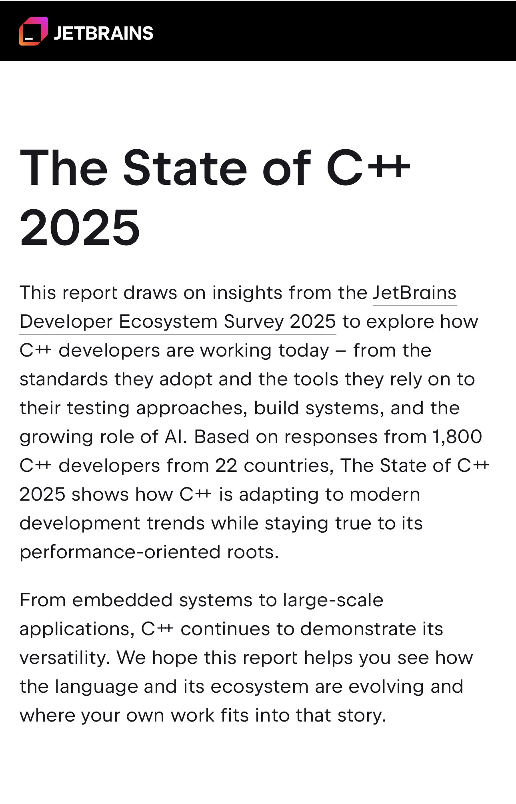
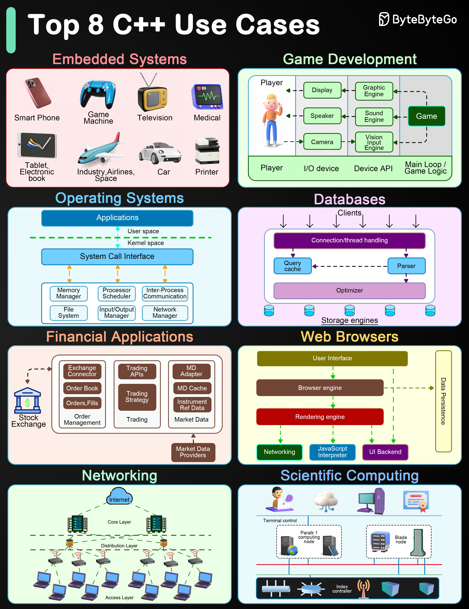

# C/C++ Project
<h2>What is C++ language?</h2>

C++ (or “C plus plus”) is a generic programming language for building software. It is an object-oriented language. In other words, it emphasizes using data fields with unique attributes (also known as objects) rather than relying on logic or functions. - COURSERA

